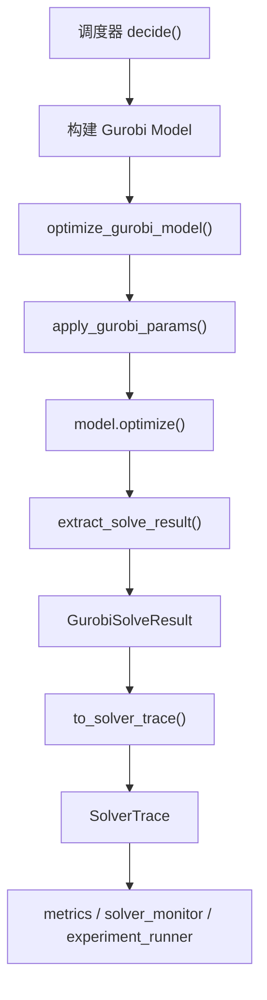
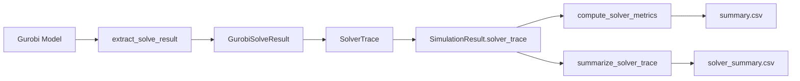

# gurobi_adapter.py 代码解析

## 1. 模块定位

文件路径：

```text
tebs_scheduler/src/tebs/gurobi_adapter.py
```

该模块是本工程的 Gurobi 适配层，作用是把 `gurobipy` 的导入、参数设置、求解执行、状态码映射和结果提取统一封装起来。这样上层调度器只需要关注 MILP 模型如何构建，不需要在每个调度器里重复处理 Gurobi 可选依赖、异常、状态码和统计字段。

当前依赖该适配层的主要模块：

```text
tebs_scheduler/src/tebs/baseline_fcfs_gurobi.py
tebs_scheduler/src/tebs/rhc_milp_gurobi.py
tebs_scheduler/tests/test_gurobi_adapter.py
```

在整体工程中，它位于如下调用链中：



## 2. 设计目标

### 2.1 保持 Gurobi 为可选依赖

`gurobipy` 是商业求解器的 Python API，不一定在所有机器上安装。因此代码不能在包导入阶段直接强依赖它。

本模块通过：

```python
importlib.util.find_spec("gurobipy")
importlib.import_module("gurobipy")
```

实现运行时检查和运行时导入。这样即使没有安装 `gurobipy`，非 Gurobi 模块仍然可以正常导入和测试。

### 2.2 统一求解参数

Gurobi 的 `TimeLimit`、`MIPGap`、`Threads`、`OutputFlag` 被封装到 `GurobiSolveParams` 中。调度器不直接散写参数名，避免多个模块出现不同默认值。

### 2.3 统一求解结果

Gurobi 原生结果保存在 model 属性中，例如：

```text
Status
SolCount
ObjVal
MIPGap
ObjBound
NodeCount
Runtime
```

适配层将这些字段转换为项目内部的 `GurobiSolveResult`，再转换为共享数据结构 `SolverTrace`。后续指标模块只处理 `SolverTrace`，不需要知道 Gurobi 的原生对象。

## 3. 异常类型解析

### 3.1 `GurobiAdapterError`

定义：

```python
class GurobiAdapterError(RuntimeError):
    """Raised when Gurobi setup or solve fails."""
```

含义：

这是 Gurobi 适配层的通用异常。只要 Gurobi 设置、模型求解或结果提取阶段出现求解器相关错误，就可以转换为这个异常类型。

上层调度器的处理方式：

1. 如果 `fallback_to_idle_on_error=True`，返回安全 idle 决策，并记录 `SolverTrace`。
2. 如果 `fallback_to_idle_on_error=False`，向上抛出调度器自己的错误，例如 `FcfsGurobiError` 或 `RhcMilpGurobiError`。

### 3.2 `GurobiUnavailableError`

定义：

```python
class GurobiUnavailableError(GurobiAdapterError):
    """Raised when gurobipy is not installed in the current environment."""
```

含义：

这是 `GurobiAdapterError` 的子类，专门表示当前 Python 环境没有安装 `gurobipy`。它用于区分“求解器未安装”和“求解器安装了但求解失败”。

典型触发位置：

```python
require_gurobi()
```

## 4. 状态常量解析

适配层定义了一组项目内部稳定状态字符串：

```python
STATUS_OPTIMAL = "OPTIMAL"
STATUS_TIME_LIMIT = "TIME_LIMIT"
STATUS_INFEASIBLE = "INFEASIBLE"
STATUS_INF_OR_UNBD = "INF_OR_UNBD"
STATUS_UNBOUNDED = "UNBOUNDED"
STATUS_SUBOPTIMAL = "SUBOPTIMAL"
STATUS_INTERRUPTED = "INTERRUPTED"
STATUS_LOADED = "LOADED"
STATUS_UNKNOWN = "UNKNOWN"
```

这样做的原因是：

1. Gurobi 原生状态是整数，不利于后续 CSV 和论文统计阅读。
2. 后续可能替换或增加其他求解器，内部仍可统一使用字符串状态。
3. `metrics.py` 和 `solver_monitor.py` 可以直接统计字符串状态。

状态码映射表：

```python
_STATUS_BY_CODE = {
    1: STATUS_LOADED,
    2: STATUS_OPTIMAL,
    3: STATUS_INFEASIBLE,
    4: STATUS_INF_OR_UNBD,
    5: STATUS_UNBOUNDED,
    9: STATUS_TIME_LIMIT,
    11: STATUS_INTERRUPTED,
    13: STATUS_SUBOPTIMAL,
}
```

状态含义说明：

| 状态常量 | 字符串值 | 含义 | 在本项目中的统计含义 |
|---|---|---|---|
| `STATUS_OPTIMAL` | `OPTIMAL` | Gurobi 已找到并证明当前模型的全局最优解。 | 计入 `optimal_slot_ratio`，同时计入 `feasible_slot_ratio`。 |
| `STATUS_TIME_LIMIT` | `TIME_LIMIT` | 求解达到 `TimeLimit` 后停止。此时可能已经找到可行解，也可能没有可行解。 | 若 `SolCount > 0`，计入 `feasible_slot_ratio`；始终计入 `timeout_ratio`。 |
| `STATUS_INFEASIBLE` | `INFEASIBLE` | 模型不可行，即不存在满足全部约束的解。 | 计入 `infeasible_ratio`，不计入可行解比例。 |
| `STATUS_INF_OR_UNBD` | `INF_OR_UNBD` | Gurobi 判断模型不可行或无界，但未区分具体是哪一种。 | 作为异常求解状态保留，通常不计入最优或可行比例。 |
| `STATUS_UNBOUNDED` | `UNBOUNDED` | 模型目标函数无界，可以沿某方向无限改善目标值。 | 对调度问题通常表示建模约束缺失或目标设置异常。 |
| `STATUS_SUBOPTIMAL` | `SUBOPTIMAL` | Gurobi 找到了可行解，但无法满足最优性容差或无法证明最优。 | 若 `SolCount > 0`，计入 `feasible_slot_ratio`，但不计入 `optimal_slot_ratio`。 |
| `STATUS_INTERRUPTED` | `INTERRUPTED` | 求解过程被用户、中断信号或外部条件打断。 | 若已存在可行解，可作为可行但非最优结果记录；否则视为无可行解。 |
| `STATUS_LOADED` | `LOADED` | 模型已创建或加载，但尚未完成优化。 | 一般不应作为正常实验结果出现；若出现，表示求解流程未真正执行或提前返回。 |
| `STATUS_UNKNOWN` | `UNKNOWN` | 状态码为空或未被适配层识别。 | 作为兜底状态，表示需要检查 Gurobi 返回值或适配层状态映射。 |

其中最常用的是：

| Gurobi 状态码 | 项目状态 | 含义 |
|---:|---|---|
| `2` | `OPTIMAL` | 已找到最优解 |
| `3` | `INFEASIBLE` | 模型不可行 |
| `9` | `TIME_LIMIT` | 到达时间限制 |
| `13` | `SUBOPTIMAL` | 找到次优解或未完全证明最优 |

## 5. `GurobiSolveParams` 解析

定义：

```python
@dataclass(frozen=True, slots=True)
class GurobiSolveParams:
    time_limit_sec: float = 5.0
    mip_gap: float = 0.01
    threads: int = 0
    verbose: bool = False
```

字段含义：

| 字段 | 对应 Gurobi 参数 | 含义 |
|---|---|---|
| `time_limit_sec` | `TimeLimit` | 单次求解最大时间，单位秒 |
| `mip_gap` | `MIPGap` | 相对最优性 gap |
| `threads` | `Threads` | 求解线程数，`0` 表示由 Gurobi 自动选择 |
| `verbose` | `OutputFlag` | 是否输出 Gurobi 求解日志 |

### 5.1 `from_config(...)`

代码逻辑：

```python
@classmethod
def from_config(cls, config: ConfigBundle | GurobiConfig | None = None) -> "GurobiSolveParams":
    if config is None:
        gurobi_cfg = load_config().gurobi
    elif isinstance(config, ConfigBundle):
        gurobi_cfg = config.gurobi
    else:
        gurobi_cfg = config
    return cls(...)
```

该方法支持三种输入：

1. `None`：自动读取默认配置文件。
2. `ConfigBundle`：从完整配置对象中读取 `.gurobi`。
3. `GurobiConfig`：直接读取 Gurobi 配置段。

好处：

1. 调度器可以直接传完整配置。
2. 测试可以只构造 Gurobi 配置段。
3. 批量实验可以统一从配置文件控制求解参数。

### 5.2 `__post_init__`

校验逻辑：

```python
if self.time_limit_sec <= 0:
    raise GurobiAdapterError("time_limit_sec must be > 0.")
if self.mip_gap < 0:
    raise GurobiAdapterError("mip_gap must be >= 0.")
if self.threads < 0:
    raise GurobiAdapterError("threads must be >= 0.")
```

这保证传给 Gurobi 的参数不会出现明显非法值。

## 6. `GurobiSolveResult` 解析

定义：

```python
@dataclass(frozen=True, slots=True)
class GurobiSolveResult:
    status: str
    raw_status: int | None
    solve_time_sec: float
    mip_gap: float | None = None
    objective_value: float | None = None
    best_bound: float | None = None
    node_count: float | None = None
    has_feasible_solution: bool = False
    solver_name: str = "gurobi"
    model_name: str | None = None
```

字段含义：

| 字段 | 来源 | 含义 |
|---|---|---|
| `status` | `map_gurobi_status(model.Status)` | 项目内部状态字符串 |
| `raw_status` | `model.Status` | Gurobi 原始整数状态 |
| `solve_time_sec` | `model.Runtime` | 求解耗时，单位秒 |
| `mip_gap` | `model.MIPGap` | 有可行解时的相对 gap |
| `objective_value` | `model.ObjVal` | 有可行解时的目标函数值 |
| `best_bound` | `model.ObjBound` | 当前最优界 |
| `node_count` | `model.NodeCount` | 分支定界节点数 |
| `has_feasible_solution` | `status == OPTIMAL or SolCount > 0` | 是否存在可行解 |
| `solver_name` | 固定为 `"gurobi"` | 求解器名称 |
| `model_name` | 调用方传入 | 模型名称，便于调试 |

### 6.1 `to_solver_trace(...)`

作用：

```python
def to_solver_trace(self, *, time_slot: int) -> SolverTrace:
```

该方法将 `GurobiSolveResult` 转换为全工程共享的 `SolverTrace`：

```text
GurobiSolveResult
  -> SolverTrace
  -> SimulationResult.solver_trace
  -> compute_metrics / solver_monitor / experiment_runner
```

为什么需要这一步：

1. 仿真器和指标模块不应该依赖 Gurobi 特有对象。
2. 后续如果加入其他求解器，只要也能输出 `SolverTrace`，指标模块无需改动。
3. `SolverTrace` 是 CSV 输出和论文统计的统一来源。

## 7. 导入与可用性检查函数

### 7.1 `is_gurobi_available()`

定义：

```python
def is_gurobi_available() -> bool:
    return importlib.util.find_spec("gurobipy") is not None
```

作用：

只检查当前 Python 环境是否能找到 `gurobipy` 包，不验证 license 是否可用。

注意：

`is_gurobi_available()` 返回 `True` 不代表一定能求解，因为 license 可能缺失或不可用。真正求解时仍可能抛出 `GurobiAdapterError`。

### 7.2 `require_gurobi()`

定义：

```python
def require_gurobi() -> Any:
    try:
        return importlib.import_module("gurobipy")
    except ModuleNotFoundError as exc:
        raise GurobiUnavailableError(...)
```

作用：

运行时导入 `gurobipy`。如果未安装，则抛出项目自定义异常 `GurobiUnavailableError`。

为什么不用文件顶部直接 `import gurobipy`：

1. 保证无 Gurobi 环境下整个 `tebs` 包仍可导入。
2. 保证规则基线、环境模型、能量模型、热模型等非 Gurobi 模块不受影响。
3. 便于测试自动 skip 或调度器 fallback。

## 8. 参数应用函数

### 8.1 `apply_gurobi_params(...)`

定义：

```python
def apply_gurobi_params(model: Any, params: GurobiSolveParams) -> None:
    model.setParam("TimeLimit", params.time_limit_sec)
    model.setParam("MIPGap", params.mip_gap)
    model.setParam("OutputFlag", 1 if params.verbose else 0)
    if params.threads > 0:
        model.setParam("Threads", params.threads)
```

功能：

将项目配置转换成 Gurobi model 参数。

当前设计细节：

1. `TimeLimit` 必设。
2. `MIPGap` 必设。
3. `OutputFlag` 根据 `verbose` 控制。
4. `Threads` 只有在 `threads > 0` 时设置；如果为 `0`，让 Gurobi 自动选择线程数。

对应测试：

```text
tests/test_gurobi_adapter.py::test_apply_gurobi_params_sets_time_limit_and_gap
```

该测试使用 `_FakeModel` 记录 `setParam` 调用，验证参数名称和值是否正确。

## 9. 求解入口函数

### 9.1 `solve_gurobi_model(...)`

定义：

```python
def solve_gurobi_model(
    model_builder: ModelBuilder,
    *,
    params: GurobiSolveParams | None = None,
    model_name: str | None = None,
) -> GurobiSolveResult:
```

调用方式：

调用方传入一个 `model_builder(gp)` 回调函数。适配层先导入 `gurobipy`，再把 `gp` 传给该回调，由回调构建 model。

流程：

```text
require_gurobi()
  -> model_builder(gp)
  -> optimize_gurobi_model(model)
  -> GurobiSolveResult
```

适用场景：

1. 测试中快速构建 toy MILP。
2. 未来新增求解模块时，用回调方式隔离 Gurobi 导入。

当前测试：

```text
tests/test_gurobi_adapter.py::test_toy_milp_solves_when_gurobi_is_available
```

测试构建一个二进制变量 `x`，约束 `x >= 1`，目标 `min x`，预期最优目标值为 `1.0`。

### 9.2 `optimize_gurobi_model(...)`

定义：

```python
def optimize_gurobi_model(
    model: Any,
    *,
    params: GurobiSolveParams | None = None,
    model_name: str | None = None,
) -> GurobiSolveResult:
```

作用：

对已经构建好的 Gurobi model 执行标准求解流程。

流程：

```text
params or GurobiSolveParams()
  -> apply_gurobi_params(model, params)
  -> model.optimize()
  -> extract_solve_result(model)
```

该函数是当前两个调度器实际使用最多的接口：

```text
baseline_fcfs_gurobi.py
rhc_milp_gurobi.py
```

为什么调度器更常用这个接口：

调度器通常需要在函数内部根据任务、核心、环境窗口构建较复杂的模型；构建完成后直接交给 `optimize_gurobi_model(...)` 求解最自然。

异常处理：

```python
try:
    model.optimize()
except Exception as exc:
    raise GurobiAdapterError(str(exc)) from exc
```

也就是说，求解阶段的 Gurobi 错误会被统一包装为 `GurobiAdapterError`。

## 10. 结果提取函数

### 10.1 `extract_solve_result(...)`

定义：

```python
def extract_solve_result(model: Any, *, model_name: str | None = None) -> GurobiSolveResult:
```

该函数从 model 属性中提取字段：

```python
raw_status = _safe_attr(model, "Status")
status = map_gurobi_status(raw_status)
sol_count = int(_safe_attr(model, "SolCount", 0) or 0)
has_feasible_solution = status == STATUS_OPTIMAL or sol_count > 0
objective_value = _safe_float_attr(model, "ObjVal") if has_feasible_solution else None
mip_gap = _safe_float_attr(model, "MIPGap") if has_feasible_solution else None
best_bound = _safe_float_attr(model, "ObjBound")
node_count = _safe_float_attr(model, "NodeCount")
solve_time = _safe_float_attr(model, "Runtime") or 0.0
```

关键逻辑：

```python
has_feasible_solution = status == STATUS_OPTIMAL or sol_count > 0
```

含义：

1. 如果状态是 `OPTIMAL`，一定有可行解。
2. 如果状态不是 `OPTIMAL`，但 `SolCount > 0`，也说明 Gurobi 找到了可行解，例如 `TIME_LIMIT` 但已有 incumbent。

这对论文统计很重要，因为：

```text
TIME_LIMIT 且有可行解
```

应计入 `feasible_slot_ratio`，但不计入 `optimal_slot_ratio`。

### 10.2 为什么使用安全读取

Gurobi 在不同求解状态下，不一定允许访问所有属性。例如无可行解时访问 `ObjVal` 可能报错。因此代码使用：

```python
_safe_attr(...)
_safe_float_attr(...)
```

避免结果提取阶段因为某个属性不可访问而中断整个仿真。

### 10.3 Gurobi 原生属性含义

`extract_solve_result(...)` 主要读取以下 Gurobi model 属性：

| Gurobi 属性 | 类型 | 含义 | 读取注意事项 |
|---|---|---|---|
| `Status` | `int` | Gurobi 求解状态码，表示模型当前求解结果，例如最优、不可行、超时等。 | 一般在 `model.optimize()` 后读取；适配层会映射为项目内部字符串状态。 |
| `SolCount` | `int` | 当前模型已找到的可行解数量。 | 即使 `Status=TIME_LIMIT`，只要 `SolCount > 0`，也说明存在可行解。 |
| `ObjVal` | `float` | 当前可行解的目标函数值。若已最优，则为最优目标值；若超时但有 incumbent，则为当前最好可行解目标值。 | 只有存在可行解时才可靠；无可行解时访问可能报错，因此适配层只在 `has_feasible_solution=True` 时读取。 |
| `MIPGap` | `float` | 当前可行解和最优界之间的相对 gap，常用于衡量 MIP 解的最优性差距。 | 只有存在可行解时有意义；无可行解时可能不可访问。 |
| `ObjBound` | `float` | 当前最优界。对于最小化问题，是 Gurobi 已证明的目标下界；对于最大化问题，是目标上界。 | 即使没有可行解，也可能存在 bound；适配层会尽量安全读取。 |
| `NodeCount` | `float` | 分支定界搜索过程中探索的节点数量。 | 用于分析 MILP 求解规模和难度；非 MIP 或极小模型可能为 `0`。 |
| `Runtime` | `float` | 本次优化运行时间，单位秒。 | 适配层转换为 `solve_time_sec`；若无法读取则默认 `0.0`。 |

这些属性是 Gurobi 原生模型对象上的属性，不是本项目自己定义的字段。适配层的作用就是把它们转换成更稳定、更适合 CSV 和论文统计的项目内部结构。

### 10.4 从 Gurobi model 到 GurobiSolveResult 的转换

转换代码集中在：

```python
extract_solve_result(model, model_name=model_name)
```

核心转换关系如下：

| Gurobi model 属性 | 中间处理 | `GurobiSolveResult` 字段 | 说明 |
|---|---|---|---|
| `model.Status` | `map_gurobi_status(raw_status)` | `status` | 将 Gurobi 整数状态码转换为 `OPTIMAL`、`TIME_LIMIT` 等字符串。 |
| `model.Status` | `int(raw_status)` | `raw_status` | 保留 Gurobi 原始状态码，便于调试或对照官方文档。 |
| `model.Runtime` | `_safe_float_attr(...) or 0.0` | `solve_time_sec` | 记录求解耗时，单位秒。 |
| `model.SolCount` | `status == OPTIMAL or SolCount > 0` | `has_feasible_solution` | 判断是否存在可行解。 |
| `model.ObjVal` | 有可行解时安全读取 | `objective_value` | 保存当前可行解目标值；无可行解时为 `None`。 |
| `model.MIPGap` | 有可行解时安全读取 | `mip_gap` | 保存相对 MIP gap；无可行解时为 `None`。 |
| `model.ObjBound` | 安全读取 | `best_bound` | 保存当前最优界。 |
| `model.NodeCount` | 安全读取 | `node_count` | 保存分支定界节点数。 |
| 调用方传入 | 原样保存 | `model_name` | 标识模型来源，例如 `adapter_toy_milp`、`rhc_milp_gurobi_window`。 |
| 固定字符串 | 默认值 | `solver_name` | 默认为 `gurobi`。 |

对应源码逻辑可以概括为：

```python
raw_status = _safe_attr(model, "Status")
status = map_gurobi_status(raw_status)
sol_count = int(_safe_attr(model, "SolCount", 0) or 0)
has_feasible_solution = status == STATUS_OPTIMAL or sol_count > 0

objective_value = _safe_float_attr(model, "ObjVal") if has_feasible_solution else None
mip_gap = _safe_float_attr(model, "MIPGap") if has_feasible_solution else None
best_bound = _safe_float_attr(model, "ObjBound")
node_count = _safe_float_attr(model, "NodeCount")
solve_time = _safe_float_attr(model, "Runtime") or 0.0
```

注意这里有两个重要设计：

1. **可行解判断不只看状态是否最优。**

   如果 `Status=TIME_LIMIT` 但 `SolCount > 0`，说明 Gurobi 虽然没有证明最优，但已经找到可执行方案。这类时隙在论文中应计入 `feasible_slot_ratio`，但不计入 `optimal_slot_ratio`。

2. **目标值和 MIPGap 只在有可行解时读取。**

   如果模型不可行或没有 incumbent，访问 `ObjVal` 或 `MIPGap` 可能失败。因此适配层用 `has_feasible_solution` 作为保护条件。

### 10.5 从 GurobiSolveResult 到 SolverTrace 的转换

`GurobiSolveResult` 是 Gurobi 适配层内部的标准求解结果；`SolverTrace` 是全工程共享的求解轨迹数据结构。二者通过：

```python
GurobiSolveResult.to_solver_trace(time_slot=current_time)
```

完成转换。

字段映射如下：

| `GurobiSolveResult` 字段 | `SolverTrace` 字段 | 说明 |
|---|---|---|
| `solver_name` | `solver_name` | 求解器名称，当前为 `gurobi`。 |
| `status` | `status` | 项目内部状态字符串。 |
| `solve_time_sec` | `solve_time_sec` | 求解耗时，单位秒。 |
| `mip_gap` | `mip_gap` | 相对 MIP gap。 |
| `objective_value` | `objective_value` | 当前可行解目标值。 |
| `best_bound` | `best_bound` | 当前最优界。 |
| `has_feasible_solution` | `has_feasible_solution` | 是否存在可行解。 |
| `node_count` | `node_count` | 分支定界节点数。 |
| 调用参数 `time_slot` | `time_slot` | 当前仿真时隙，由调度器传入。 |

`raw_status` 和 `model_name` 不进入 `SolverTrace`。原因是：

1. `SolverTrace` 面向统一实验统计，不保留求解器私有状态码。
2. `model_name` 更偏调试信息，而当前仿真统计按时隙和方法聚合。
3. 若后续需要更细调试，可以扩展 `SolverTrace` 或额外输出 solver debug CSV。

转换后的 `SolverTrace` 会进入：

```text
SimulationResult.solver_trace
```

然后被以下模块使用：

```text
metrics.compute_metrics(...)
solver_monitor.summarize_solver_trace(...)
experiment_runner 写出 solver_trace.csv 和 solver_summary.csv
visualization.render_solver_statistics(...)
```

### 10.6 完整转换示例

假设某个滚动窗口求解结果为：

```text
Status = 9
SolCount = 1
ObjVal = 125.0
MIPGap = 0.03
ObjBound = 121.25
NodeCount = 240
Runtime = 5.0
```

第一步，`extract_solve_result(...)` 转换为：

```python
GurobiSolveResult(
    status="TIME_LIMIT",
    raw_status=9,
    solve_time_sec=5.0,
    mip_gap=0.03,
    objective_value=125.0,
    best_bound=121.25,
    node_count=240.0,
    has_feasible_solution=True,
    solver_name="gurobi",
    model_name="rhc_milp_gurobi_window",
)
```

第二步，调度器调用：

```python
solver_trace = result.to_solver_trace(time_slot=current_time)
```

得到：

```python
SolverTrace(
    time_slot=current_time,
    solver_name="gurobi",
    status="TIME_LIMIT",
    solve_time_sec=5.0,
    mip_gap=0.03,
    objective_value=125.0,
    best_bound=121.25,
    has_feasible_solution=True,
    node_count=240.0,
)
```

该时隙在统计中会被解释为：

```text
不是最优解时隙
是可行解时隙
是超时时隙
MIPGap = 0.03
求解时间 = 5.0 s
```

## 11. 状态映射函数

### 11.1 `map_gurobi_status(...)`

定义：

```python
def map_gurobi_status(status_code: int | None) -> str:
    if status_code is None:
        return STATUS_UNKNOWN
    return _STATUS_BY_CODE.get(int(status_code), STATUS_UNKNOWN)
```

作用：

把 Gurobi 原始整数状态映射为项目内部字符串。

边界行为：

1. `status_code is None`：返回 `UNKNOWN`。
2. 未收录的状态码：返回 `UNKNOWN`。

对应测试：

```text
tests/test_gurobi_adapter.py::test_status_mapping_covers_core_gurobi_statuses
```

当前测试覆盖：

```text
2 -> OPTIMAL
3 -> INFEASIBLE
9 -> TIME_LIMIT
```

## 12. 私有辅助函数

### 12.1 `_safe_attr(...)`

定义：

```python
def _safe_attr(model: Any, name: str, default: Any = None) -> Any:
    try:
        return getattr(model, name)
    except Exception:
        return default
```

用途：

安全读取 model 属性。若属性不存在或 Gurobi 因当前状态禁止访问该属性，则返回默认值。

### 12.2 `_safe_float_attr(...)`

定义：

```python
def _safe_float_attr(model: Any, name: str) -> float | None:
    value = _safe_attr(model, name)
    if value is None:
        return None
    try:
        return float(value)
    except (TypeError, ValueError):
        return None
```

用途：

安全读取并转换为浮点数。用于：

```text
MIPGap
ObjVal
ObjBound
NodeCount
Runtime
```

## 13. 上层调度器如何使用适配层

### 13.1 `FCFS-Gurobi`

调用位置：

```text
tebs_scheduler/src/tebs/baseline_fcfs_gurobi.py
```

核心调用：

```python
gp = require_gurobi()
model = gp.Model("fcfs_gurobi_current_slot")
...
result = optimize_gurobi_model(
    model,
    params=params,
    model_name="fcfs_gurobi_current_slot",
)
solver_trace = result.to_solver_trace(time_slot=current_time)
```

异常处理：

```python
except (GurobiUnavailableError, GurobiAdapterError) as exc:
    if not self.fallback_to_idle_on_error:
        raise FcfsGurobiError(str(exc)) from exc
    return SchedulerResult(idle_decisions, solver_trace=fallback_trace)
```

也就是说，在没有 Gurobi 或求解失败时，默认返回安全 idle；如果测试或实验要求严格暴露错误，则可以设置 `fallback_to_idle_on_error=False`。

### 13.2 `RHC-MILP-Gurobi`

调用位置：

```text
tebs_scheduler/src/tebs/rhc_milp_gurobi.py
```

核心调用：

```python
gp = require_gurobi()
model = gp.Model("rhc_milp_gurobi_window")
...
result = optimize_gurobi_model(
    model,
    params=params,
    model_name="rhc_milp_gurobi_window",
)
solver_trace = result.to_solver_trace(time_slot=current_time)
```

该模块使用适配层记录每个滚动窗口的求解状态，后续进入：

```text
SimulationResult.solver_trace
metrics.compute_metrics(...)
solver_monitor.summarize_solver_trace(...)
experiment_runner 输出 solver_summary.csv
```

## 14. 与测试文件的对应关系

测试文件：

```text
tebs_scheduler/tests/test_gurobi_adapter.py
```

测试项：

| 测试函数 | 覆盖内容 | 说明 |
|---|---|---|
| `test_apply_gurobi_params_sets_time_limit_and_gap` | 参数设置 | 用 fake model 验证 `TimeLimit`、`MIPGap`、`Threads`、`OutputFlag`。 |
| `test_status_mapping_covers_core_gurobi_statuses` | 状态映射 | 验证 `OPTIMAL`、`INFEASIBLE`、`TIME_LIMIT` 三个核心状态。 |
| `test_toy_milp_solves_when_gurobi_is_available` | 真实求解 | 有 Gurobi 时求解一个最小 MILP；无 Gurobi 或 license 不可用时 skip。 |

当前工作区 `.venv` 下真实 Gurobi 测试结果：

```text
tests/test_gurobi_adapter.py: 3 passed
```

全量测试结果：

```text
74 passed
```

## 15. 数据流总结

Gurobi 求解统计从模型到 CSV 的完整流向如下：



关键转换：

```text
model.Status      -> status
model.Runtime     -> solve_time_sec
model.MIPGap      -> mip_gap
model.ObjVal      -> objective_value
model.ObjBound    -> best_bound
model.NodeCount   -> node_count
model.SolCount    -> has_feasible_solution
```

## 16. 当前实现的优点

1. **可选依赖友好**：没有 Gurobi 时，基础模块仍可导入和运行。
2. **参数集中**：所有 Gurobi 参数通过 `GurobiSolveParams` 管理。
3. **状态稳定**：原始整数状态转换为项目内部字符串，便于 CSV 和论文统计。
4. **结果统一**：统一输出 `GurobiSolveResult` 和 `SolverTrace`。
5. **上层简洁**：调度器只负责建模，求解和结果提取交给适配层。
6. **测试容易**：参数设置和状态映射可用 fake model 测试；真实求解可在有 license 时运行。

## 17. 当前实现的注意事项

1. `is_gurobi_available()` 只检查包是否存在，不检查 license。
2. license 不可用时，通常会在 `model.optimize()` 阶段抛出异常，并被包装为 `GurobiAdapterError`。
3. `_safe_attr(...)` 会吞掉属性读取异常，适合结果提取，但不适合用于调试模型本身。
4. `GurobiSolveParams` 当前只封装了少量参数，后续若做大规模实验，可扩展 `Presolve`、`MIPFocus`、`Heuristics` 等参数。
5. `extract_solve_result(...)` 的 `has_feasible_solution` 依赖 `SolCount`，这符合 Gurobi 常规语义；如果未来接入其他求解器，需要重新确认对应字段。

## 18. 后续可扩展方向

可以考虑扩展以下能力：

1. 在 `GurobiSolveParams` 中加入更多 profile 参数，例如 `MIPFocus`、`Heuristics`、`Presolve`。
2. 增加 `license_check()` 工具函数，区分“已安装但无 license”和“完整可求解”。
3. 增加模型导出功能，例如在调试时写出 `.lp` 或 `.mps` 文件。
4. 在 `GurobiSolveResult` 中增加 `gap_abs`、`solution_count` 等字段。
5. 在 `extract_solve_result(...)` 中记录更多 Gurobi 诊断信息，便于论文中分析求解器行为。

## 19. 论文中可引用的代码说明

可在论文实现章节中写：

```text
代码实现中设置了独立的 Gurobi 适配层，用于封装 gurobipy 的导入、参数设置、模型求解和结果解析。适配层将 Gurobi 原生状态码映射为统一的字符串状态，并将 Runtime、MIPGap、ObjVal、ObjBound、NodeCount 等求解信息转换为 SolverTrace。仿真器在每个滚动时隙收集 SolverTrace，实验结束后统一统计最优解比例、可行解比例、超时比例和求解时间分布。
```

也可以写：

```text
为保证代码在无 Gurobi 环境下仍可复现实验的非优化部分，工程未在包导入阶段直接依赖 gurobipy，而是在需要求解 MILP 时通过适配层动态导入。若 gurobipy 未安装或 license 不可用，调度器可返回安全 idle 作为 fallback，相关测试也会自动跳过。
```
